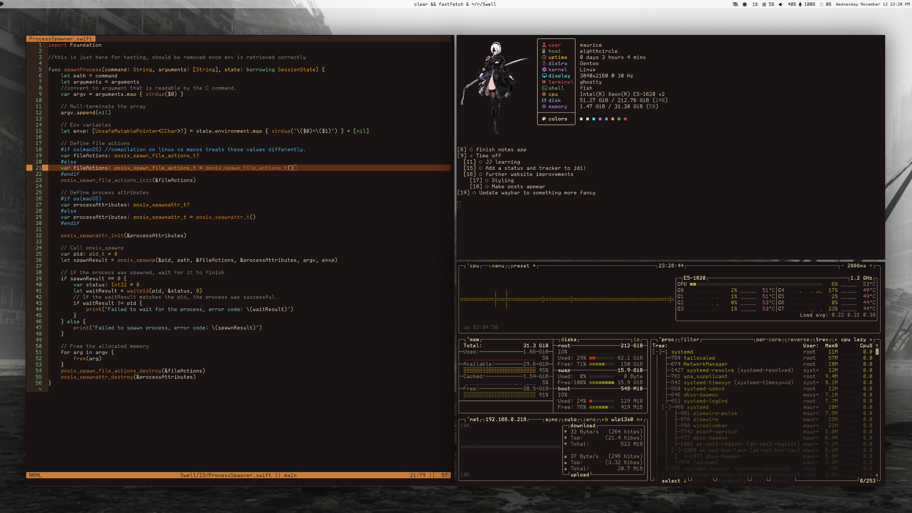

# ghostt-automata
### Update
I have added a new dark theme, also the screenshot for that theme is using Annotation mono rather than the CommitMono that's included in the repo.

A Nier Automata themed colour scheme for Ghostty terminal, Fastfetch, and Helix.

To install simply copy the folders in config to your own .config folder, however I recommend checking them first as I've not removed any of the configuration relevant to my own set up.

I've used a lot of artistic licence when it comes to the colours used so as to give them better contrast. So this won't be purely accurate to the in game UI.

The images I've used for fastfetch are not mine, I took them from the nier wiki, they can be found [here, as the main image and under the media section and the Reincarnation tab](https://nier.fandom.com/wiki/YoRHa_No.2_Type_B#Reincarnation).

In the fast fetch I've included one image, and one commented out, to give you an idea of how to switch/make the images fit.
